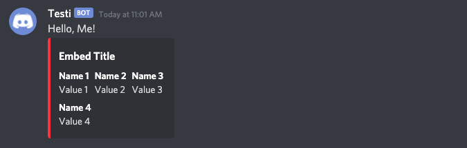

[](https://goreportcard.com/report/github.com/darmiel/discord-webhook-proxy)

# Discord Webhook Proxy

Demo at [whgoxy.d2a.io](https://whgoxy.d2a.io) *(no uptime gurantee)*

---

## ToC
- [ToC](#toc)
- [Okay, so here's the thing:](#okay-so-heres-the-thing)
- [Examples](#examples)
  - [Placeholders](#placeholders)
  - [List](#list)

---

## Okay, so here's the thing:

Many websites / services offer the ability to call webhooks on certain actions.  
Unfortunately, **only a few of them offer webhook support for Discord**, so for most websites / services you have to write a small tool to handle these requests.

For example, I'm using a **Raspberry Pi** with [MotionEyeOS](https://github.com/ccrisan/motioneyeos) as a **surveillance camera**, and I wanted to use Discord webhooks to notify me when motion was detected, so I had to develop a [small tool](https://github.com/darmiel/gomera).
However, it occurred to me that this isn't the first time I've had to go through such a roundabout way just to receive a simple webhook. So I thought to write a "*universal*" Discord webhook "*proxy*", which can transform any kind of request to a valid Discord webhook.

Check out the examples to see how dynamically these webhooks can be created.  
The [Go Template Engine](https://golang.org/pkg/text/template/) is used.

## Examples
### Dynamic Fields
**Webhook**
```
{{ define "fields" }}
    {{ range $k, $v := . }}
        {{- if $k }}
            {{- "," -}}
        {{ end }}
        {
            "name": "{{ $v.Name }}",
            "value": "{{ $v.Value }}",
            "inline": true
        }
    {{ end }}
{{ end }}

{
    "content": "Hello, {{ .User }}!",
    "embeds": [
        {
            "title": "Embed Title",
            "color": 16725044,
            "fields": [
                {{ template "fields" .F }}
            ]
        }
    ]
}
```

**POST /call/json**
```json
{
  "User": "Me",
  "M": [
    {
      "Name": "Name 1",
      "Value": "Value 1"
    },
    {
      "Name": "Name 2",
      "Value": "Value 2"
    },
    {
      "Name": "Name 3",
      "Value": "Value 3"
    },
    {
      "Name": "Name 4",
      "Value": "Value 4"
    }
  ]
}
```

**Output**  


### Placeholders
**Webhook**
```json
{
  "content": "[ @everyone ]",
  "username": "Notify for {{ .Camera.Name }}",
  "avatar_url": "{{ .Camera.Avatar }}",
  "embeds": [
    {
      "title": "👉 Live stream",
      "description": "Detected motion on camera {{ .Camera.Name }}",
      "color": 16725044,
      "url": "{{ .Camera.Stream }}",
      "fields": [
        {"name": "📸", "value": "{{ .Camera.Name }}", "inline": true},
        {"name": "📸", "value": "{{ .Camera.ID }}", "inline": true}
      ],
      "author": {
        "name": "{{ .Camera.Name }} / {{ .Camera.ID }}",
        "icon_url": "{{ .Camera.Avatar }}"
      }
    }
  ]
}
```

**POST /call/json**
```
{
    "Camera": {
        "ID": 1,
        "Name": "Attic Camera",
        "Avatar": "https://image.com/camera.png",
        "Stream": "http://192.168.0.5:80"
    }
}
```

**Output**  


### List
**Webhook**
```json
{
      "content": "[ @everyone ]\n\n
    **My favorite musicians:**\n
    {{ if .Musicians }}
      ```markdown\n
      {{ range .Musicians }}
        * {{ . }}\n
      {{ end }}
      ```\n
    {{ else }}
      I don't have any favorite musicians 🙃
    {{ end }}"
}
```

**POST /call/json**
```json
{
    "Musicians": [
        "Lil Dicky",
        "Fanta Vier",
        "Audio88",
        "Gorillaz",
        "grandson"
    ]
}
```

**Output**  

