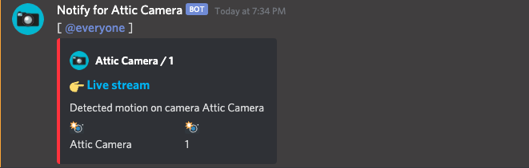

# Discord Webhook Proxy
## Okay, so here's the thing:

Many websites / services offer the ability to call webhooks on certain actions.  
Unfortunately, **only a few of them offer webhook support for Discord**, so for most websites / services you have to write a small tool to handle these requests.

For example, I'm using a **Raspberry Pi** with [MotionEyeOS](https://github.com/ccrisan/motioneyeos) as a **surveillance camera**, and I wanted to use Discord webhooks to notify me when motion was detected, so I had to develop a [small tool](https://github.com/darmiel/gomera).

In the middle of this, however, it occurred to me that this isn't the first time I've had to go through such a roundabout way just to receive a simple webhook. So I thought to write a "*universal*" Discord webhook "*proxy*", which can forward any kind of request to a valid Discord webhook.

For this, the JSON of the webhook is stored with placeholders, like {{ test }}, in a sqlite3 database, which will be replaced by the URL query parameters later and sent to the specified webhook:

## Examples
### Placeholders
**Webhook**
```json
{
  "content": "[ @everyone ]",
  "username": "Notify for {{ .Camera.Name }}",
  "avatar_url": "{{ .Camera.Avatar }}",
  "embeds": [
    {
      "title": "👉 Live stream",
      "description": "Detected motion on camera {{ .Camera.Name }}",
      "color": 16725044,
      "url": "{{ .Camera.Stream }}",
      "fields": [
        {"name": "📸", "value": "{{ .Camera.Name }}", "inline": true},
        {"name": "📸", "value": "{{ .Camera.ID }}", "inline": true}
      ],
      "author": {
        "name": "{{ .Camera.Name }} / {{ .Camera.ID }}",
        "icon_url": "{{ .Camera.Avatar }}"
      }
    }
  ]
}
```

**POST /call**
```
{
    "Camera": {
        "ID": 1,
        "Name": "Attic Camera",
        "Avatar": "https://image.com/camera.png",
        "Stream": "http://192.168.0.5:80"
    }
}
```

**Output**  


### List
**Webhook**
```json
{
      "content": "[ @everyone ]\n\n
    **My favorite musicians:**\n
    {{ if .Musicians }}
      ```markdown\n
      {{ range .Musicians }}
        * {{ . }}\n
      {{ end }}
      ```\n
    {{ else }}
      I don't have any favorite musicians 🙃
    {{ end }}"
}
```

**POST /call**
```json
{
    "Musicians": [
        "Lil Dicky",
        "Fanta Vier",
        "Audio88",
        "Gorillaz",
        "grandson"
    ]
}
```

**Output**  

